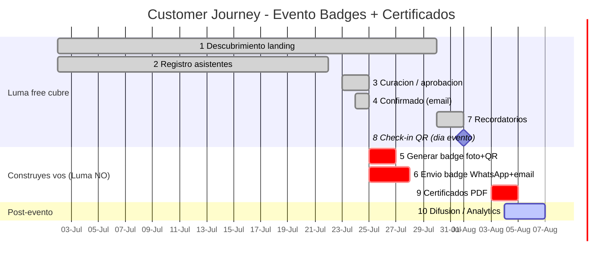
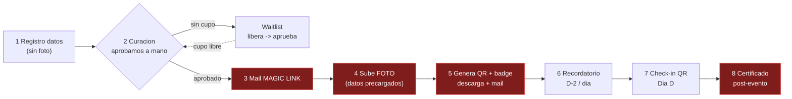

# 🎟️ Customer Journey — Evento 50 invitados (Badges + Certificados)

Mapa del recorrido del invitado: **registro → confirmación → badge → check-in → certificados**.
Marca hasta dónde llega **Luma free** y qué se construye aparte.

> Día del evento = **D (2026-08-01, ejemplo)**. Cambiá las fechas y el gráfico se reacomoda.
> 🔴 rojo = Luma NO lo hace, lo construís vos · ✅ verde = Luma free lo cubre.

---

## 📅 Timeline

---

## 🔀 Flujo del invitado

> 🔴 rojo = self-service badge (magic link + subir foto + generar + certificado) → **Luma NO lo hace, app propia**.
> ✅ Luma cubre registro (1), aprobación (2), recordatorio (6), check-in (7).

---

## 🧩 Frontera Luma free vs construir

| # | Etapa | Fecha | Herramienta | Luma free |
|---|---|---|---|---|
| 1 | Descubrimiento | D-30 | Luma / landing | ✅ |
| 2 | Registro (foto) | D-30 → D-10 | Luma / Tally free | ⚠️ foto limitada |
| 3 | Curación | D-9 | Luma / dashboard | ✅ |
| 3b | Rechazo / Waitlist | D-8 | Luma | ✅ |
| 4 | Confirmado | D-8 | Luma / Resend | ✅ |
| 5 | **Badge foto+QR** | D-7 | satori | ❌ construir |
| 6 | **Envío WhatsApp+email** | D-7 | Resend + wa.me | ❌ construir |
| 7 | Recordatorios | D-2 | Luma / Resend | ✅ |
| 8 | Check-in QR | Día D | Luma app / propio | ✅ |
| 9 | **Certificados PDF** | D+2 | pdf-lib | ❌ construir |
| 10 | Difusión / Analytics | D+3 | Luma básico | ⚠️ API = Plus |

---

## 💸 Costo según camino

| Camino | Costo | Nota |
|---|---|---|
| Luma free + app propia | **$0** | Luma cubre 1–4,7,8. Export CSV manual → tu app hace 5,6,9 |
| Luma Plus + API | ~$59/mes | Todo automático, tiempo-real |
| Sin Luma (Tally free) | **$0** | Form propio webhook → tu app hace TODO, tiempo-real |

> ⚠️ Sin **Luma Plus** no hay API: solo export CSV manual. Certificados e integraciones requieren Plus o construir aparte.

---

## 📂 Docs del proyecto
- [`TIMELINE.md`](./TIMELINE.md) — gráficos timeline
- [`RESEARCH.md`](./RESEARCH.md) — repos, costos, links, jerga
- [`JOURNEY.md`](./JOURNEY.md) — state machine detallada
